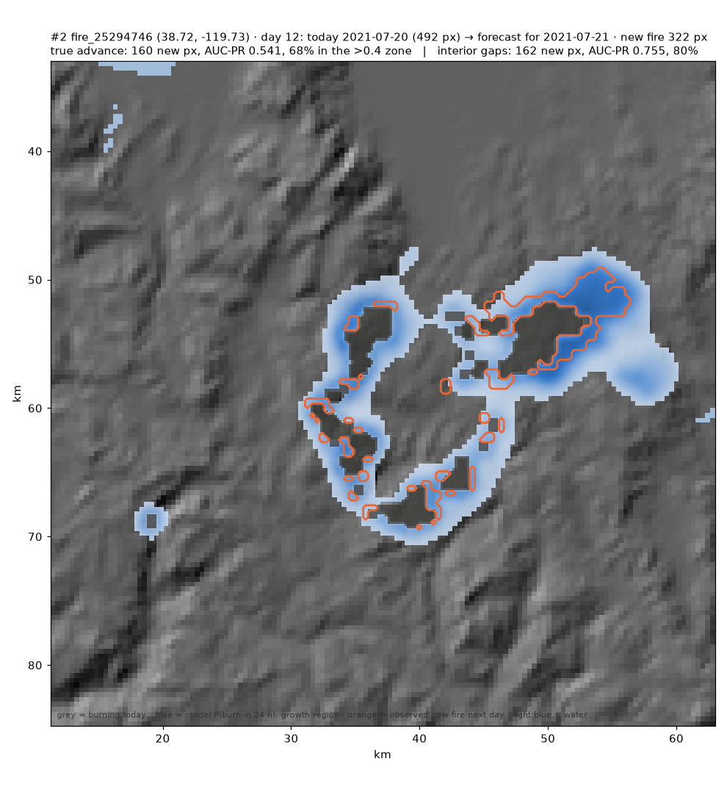

  

Next-day wildfire spread as per-pixel probability: today's active-fire mask + terrain, weather, fuel and land cover on a
375 m grid → P(active fire in the next 24 h) for every pixel. Built at the Frontier Cascadia hackathon, September 2026.

**Live demo map:** https://eitanlebras.github.io/fire-spread-forecast/

  

Fire 25294746, day 12 (2021-07-20). Grey is burning today, blue is the model's probability of burning in the next 24 hours, orange outlines the fire actually observed the next day.

**Model: [eitanlebras/fire-spread-forecast-v1-small](https://huggingface.co/eitanlebras/fire-spread-forecast-v1-small)** on Hugging Face
(MIT, 1.94 M-parameter UNet, weights + `config.json` with the mandatory normalization stats + standalone `inference.py` + model card).

## Results (WildfireSpreadTS test split 2021, 30 held-out fires, 3 seeds, 95% CI)

| arm | AUC-PR | persistence | ECE | growth region (pixels not burning today) |
|---|---|---|---|---|
| **WFTS 40 channels, UNet (published)** | **0.552 ± 0.003** | 0.273 | 0.0044 | 0.243 (persistence 0.003) |
| + OlmoEarth v1.2-Small, last 2 blocks post-trained (not published) | 0.547 ± 0.006 | 0.273 | 0.0062 | 0.238 |
| NDWS 64×64 1 km baseline, 5 seeds at epoch 4 (footnote, different dataset) | eval 0.27 | 0.11 | | |

Interior fill vs true advance, pooled over 599 held-out fire-days (`demo/frames_advance_test/`): interior gaps AUC-PR 0.451
(chance 0.240, 83% of that fire in the >0.4 zone); true advance AUC-PR 0.065 (chance 0.0012, 54× chance, 19% in the >0.4 zone).
Detached spot fires: never predicted (0 hits). The OlmoEarth post-training gave no measurable gain (overlapping intervals,
slightly worse calibration, eval plateaued by epoch 15 while train loss fell); its weights are a derivative under Ai2's
OlmoEarth Artifact License and are deliberately not distributed.

## Layout

- `fsf/` — pipeline: `wfts.py` (GeoTIFF → fp16 tile cache, authors' preprocessing), `wfts_remote.py` (fetch fires from the
  Zenodo zip by HTTP range), `train_olmo.py` (vmapped multi-seed trainer, WFTS ± OlmoEarth), `train.py` / `data.py` /
  `features.py` (NDWS arms), `predict.py` (checkpoint → per-day probability GeoTIFFs, water-masked), `s2_pull.py` /
  `olmo.py` (Sentinel-2 composites and OlmoEarth embeddings for the ablation), `day_sweep.py` / `growth_sweep.py` /
  `split_sweep.py` (per-day evaluation, interior-vs-advance split), `metrics.py`, `report.py`.
- `configs/` — every arm; every run appends config + metrics to `results/runs.parquet`.
- `viz/` — `demo_map.py` (standalone HTML map: real HIFLD lines/substations, growth-region probability, exposure ranking),
  `replay.py` (forecast vs observed GIF), `frames.py`, `exposure.py`, `hifld_coverage.py`, `results.py`.
- `demo/` — Redding and Lake Chelan maps, replays, labelled per-day frames, advance-frame rankings, exposure tables.
- `results/` — `runs.parquet` and per-run detail JSON (curves, reliability diagrams).
- `scripts/bootstrap_pod.sh` — one-shot cloud-box setup (data fetch, venvs).

Data: [WildfireSpreadTS](https://doi.org/10.5281/zenodo.8006177) (Gerard et al., NeurIPS 2023 D&B, CC-BY-4.0), 258 fires
2018–2021; the authors' year folds (train 2018–19, eval 2020, test 2021). NDWS (Huot et al. 2022) for the early baseline.

Not for evacuation decisions. 375 m / 24 h; trained on western-US events only; labels confounded by suppression; no spotting.
